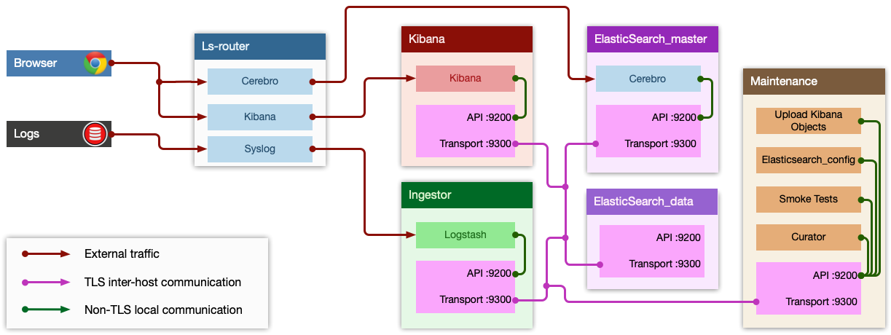

# Logsearch

A scalable stack of [Elasticsearch](https://www.elastic.co/elasticsearch), [Logstash](https://www.elastic.co/logstash), and [Kibana](https://www.elastic.co/kibana) for your own [BOSH](https://bosh.io/docs)-managed infrastructure.



## BREAKING CHANGES

### Logsearch v211 is based on Elastic stack version 7
In v211.1.0 basic cluster security features were implemented using [Securiry](https://opendistro.github.io/for-elasticsearch-docs/docs/install/plugins/) plugin from OpenDistro Elasticsearch implementation. For better handling of these features, a following changes was made:

- Additional Elasticsearch job has been colocated on **Maintenance** instance. This allows secure communication over localhost for all singletons also colocated there (all singletons have been unlinked from any remote Elasticsearch cluster, and bound to local one).
- Since using of Ls-rounter instance is not mandatory - it was moved to separate [ops-file](deployment/operations/enable-router.yml).
- Secure Elasticsearch node-to-node communication has been implemented using [enable-tls](deployment/operations/enable-tls.yml) ops-file.
- Secure ingesting logs is implemented using [enable-ssl](deployment/operations/enable-ssl.yml) ops-file.

### Logsearch v210 is based on Elastic stack version 6

- Elasticsearch 6.x can use indices created in Elasticsearch 5.x, but not those created in Elasticsearch 2.x or before.
- **Important**: After upgrading running 5.x cluster to 6.x all existing indicies will be available for reading data. However, writing to these indicies is not possible. In order to write data immediatelly after upgrade you have to [change index naming convention](https://github.com/cloudfoundry-community/logsearch-boshrelease/commit/2f83b41ee14dbe3141e21cc0c40df340d50e0169). As long as index names are usually based on current date, this change can be safely reverted in a day or so.

### Logsearch v204 is based on Elastic stack version 5.
- For upgrade procedure from Elasticsearch 2.x please refer to [v205.0.0 release notes](https://github.com/cloudfoundry-community/logsearch-boshrelease/releases/tag/v205.0.0#component-updates).

### Logsearch v200 is based on Elasticsearch 2.x and Kibana 4.
- There is NO upgrade path from Elasticsearch 1.x to 2.x.  Sorry :(

### Logsearch < v23 was based on Elasticsearch 1.x and Kibana 3.

## Getting Started

This repo contains Logsearch Core; which deploys an ELK cluster that can receive and parse logs via syslog that contain JSON.

Most users will want to combine Logsearch Core with a Logsearch Addon to customise their cluster for a
particular type of logs.  Its likely you want to be following an Addon installation guides - see below
for a list of the common Addons:

  * [Logsearch for CloudFoundry](https://github.com/cloudfoundry-community/logsearch-for-cloudfoundry)


## Installing Logsearch Core

Before starting deployment, make sure your BOSH environment is ready, and all `BOSH_` evironment variables are set. We suggest you to use [BBL](https://github.com/cloudfoundry/bosh-bootloader) tool to spin up the BOSH environment.

```
$ cd deployment
$ bosh -d logsearch deploy logsearch-deployment.yml
```
## Common customisations:

Adding new parsing rules:

        logstash_parser:
          filters: |
             # Put your additional Logstash filter config here, eg:
             json {
                source => "@message"
                remove_field => ["@message"]
             }


### Release Channels

 * The latest stable, final release will be soon available on [bosh.io](http://bosh.io/releases)
 * **develop** - The develop branch in this repo is deployed to our test environments.  It is occasionally broken - use with care!

## Known issues


## License

[Apache License 2.0](./LICENSE)
